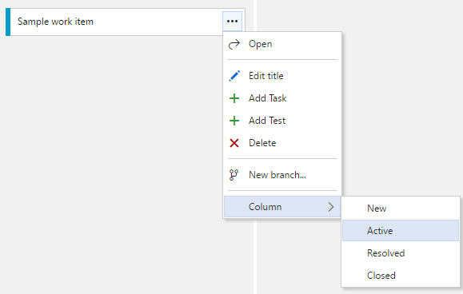
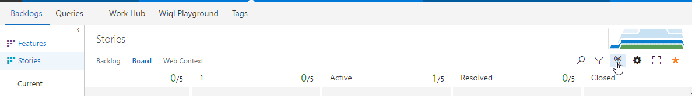
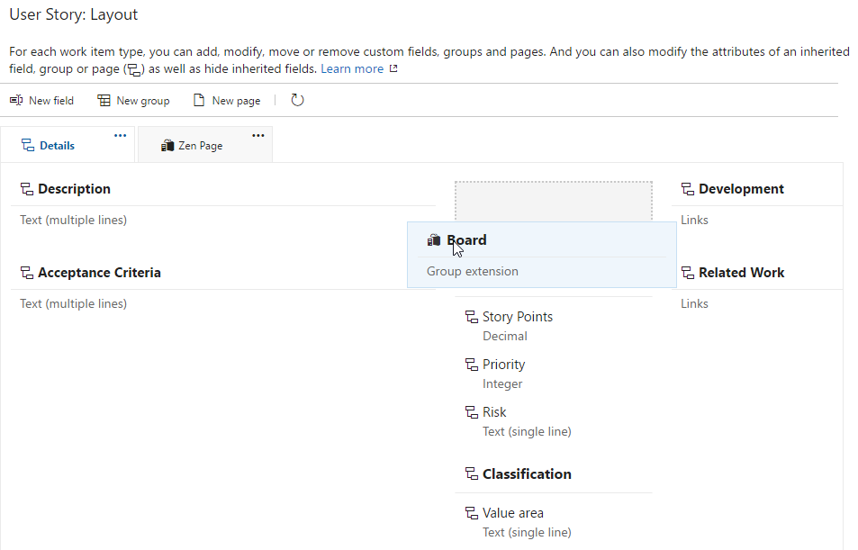

Adds a link to the associated board. Allows changing of the lane, column, and done column the work item is on with dropdowns.  
  
Adds a context menu items to the kanban cards to change column and row without dragging.  
  
Be sure to enable live updates when using the context menu on the cards.
  
Bulk edit from queries and backlogs views the multiselect context menu  


# Configuration with on Team Services 

To configure where the board group is added click on the customize option from the work item form.  
  
Then drag the group where desired or hide it.  


# Configuration using process template

Navigate the process template xml.
For each work item type to customize at the location 
```xpath
/WITD/WORKITEMTYPE/FORM/WebLayout/Extensions
```
add 
```xml
<Extension Id="ottostreifel.board-group" />
```
Within the same Weblayout choose a Section element and add
```xml
<GroupContribution Label="Board" Id="ottostreifel.board-group.board-work-item-form-group"/>
```


# Change Log
(02/10/17) 2.5.1 Show column position and add move to top action
(02/10/17) 2.4.70 Show error message when update fails on form
(04/24/17) 2.4.44 Filter out inactive boards  
(04/24/17) 2.4.35 Allow team to be selected from form  
(04/22/17) 2.4.1 Bulk edit of from queries and backlogs views  
(04/08/17) 2.3.51 Info callout  
(04/08/17) 2.3.37 Update styling  
Add more screenshots to details page  
(04/05/17) 2.3.1 Show board even when not in team context  
(01/26/17) 2.2.6 Refresh WI on board field change  
(01/24/17) 2.2.3 Github link  
(12/17/16) 2.2.1 Adds context menu to board  
(12/09/16) 2.1.15 Switches to immediate save model to avoid issue where save is sometimes not completed.  
(12/08/16) 2.1.10 Fixes dropdown clipping, Makes save buttons more consistent  
(11/19/16) 2.1.3 Updates details.md  
(11/19/16) 2.1.2 Updates change log.  
(11/19/16) 2.1.1 Fixes bug where group was not updated when switching between workitems in query results view.  
(11/19/16) 2.0.4 Dropdown width.  
(11/17/16) 2.0.1 Moves from form service to rest api.
