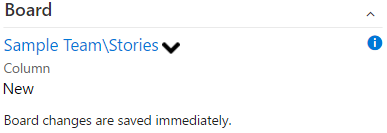
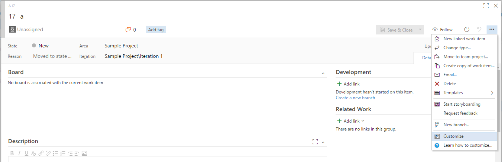

Adds a link to the associated board. Allows changing of the lane, column, and done column the work item is on with dropdowns.



# Configuration with on Team Services 
To configure where the board group is added click on the customize option from the work item form. Then drag the group where desired or hide it.

 

# Configuration using process template

Navigate the process template xml.
For each work item type to customize at the location 
```xpath
/WITD/WORKITEMTYPE/FORM/WebLayout/Extensions
```
add 
```xml
<Extension Id="ottostreifel.board-group" />
```
Within the same Weblayout choose a Section element and add
```xml
<GroupContribution Label="Board" Id="ottostreifel.board-group.board-work-item-form-group"/>
```


# Change Log
v2.1.10

Fixes dropdown clipping

Makes save buttons more consistant

v2.1.3

Updates details.md

v2.1.2

Updates change log.

v2.1.1

Fixes bug where group was not updated when switching between workitems in query results view.

v2.0.4

Dropdown width.

v2.0.1

Moves from form service to rest api.